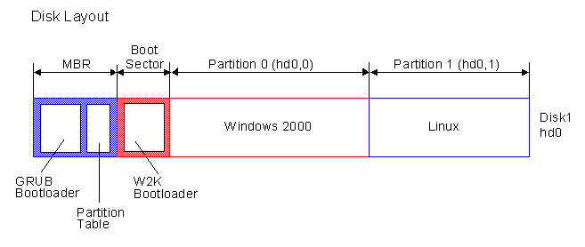

# QEMU MBR Boot :computer:



A QEMU-based project for learning Linux system porting, including **U-Boot, RootFS, Kernel, and Kernel Module** development. Perfect for experimenting with embedded Linux without physical hardware!

---

## :rocket: Features
- **Disk Image Automation**: Creates partitioned disk images (`disk.img` for x86, `arm-disk.img` for ARM).
- **U-Boot Integration**: Build U-Boot binary form buildroot. Burns U-Boot binaries to disk images with correct offsets.
- **RootFS Ready**: Formats partitions and deploys root filesystems.
- **QEMU Boot Ready**: Pre-configured QEMU commands for x86/ARM with kernel/DTB support.
- **Makefile-Driven**: Single-command workflows for building, running, and cleaning.

---

## :wrench: Core Components
1. **Disk Image Preparation**
   - Generates raw disk images with MBR partitions.
   - Supports x86 (`disk.img`) and ARM (`arm-disk.img`).

2. **U-Boot & RootFS Deployment**
   - Formats partitions (ext4/FAT32).
   - Burns U-Boot to precise offsets (`seek=1` for MBR safety).
   - Copies RootFS to target partitions.

3. **QEMU Execution**
   - Boots with specified kernel/DTB.
   - Configurable peripherals (network, serial, etc.).

---

## :arrow_forward: Quick Start
```bash
# Build disk image and deploy U-Boot/RootFS
make all

# Launch QEMU (x86)
make run-x86

# Launch QEMU (ARM)
make run-arm

# Clean artifacts
make clean
